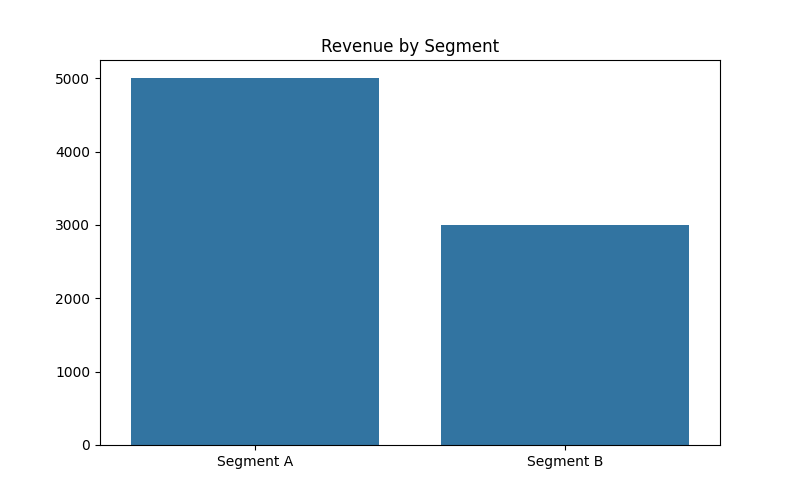
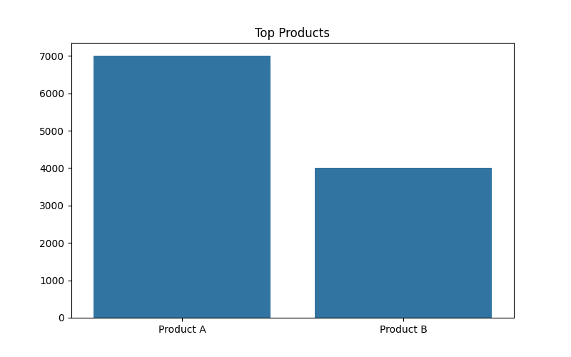
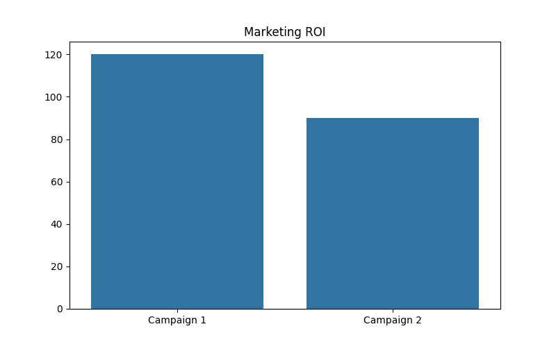
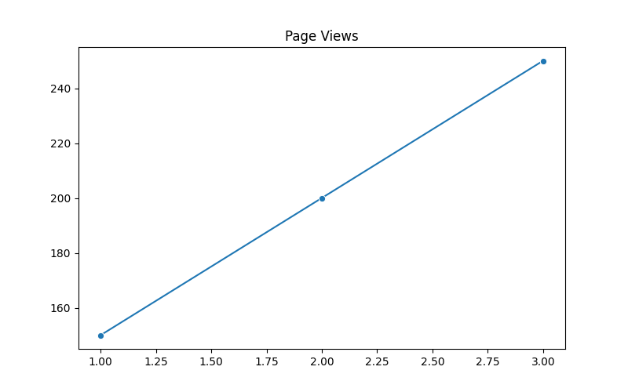

# General Marketplace Analytics

## Project Overview
This project simulates a **general online marketplace** and demonstrates end-to-end data analytics, from synthetic data generation to interactive dashboards. It covers user behavior, product performance, session activity, and marketing ROI. This is a **portfolio-ready project** showcasing Python data analytics skills.

---

## Tools & Technologies
- **Programming & Data Handling:** Python, Pandas, NumPy  
- **Visualization:** Matplotlib, Seaborn, Plotly  
- **Environment:** Google Colab  

---

## Dataset
The project uses **synthetic data** generated for analysis:

- **Users:** 200+ users with age, gender, location, and segments (including fashion shoppers)  
- **Products:** 100+ products across categories like Electronics, Home, Fashion, Sports  
- **Orders:** 300+ orders with quantities, revenue, and payment methods  
- **Sessions:** Page views and session durations  
- **Campaigns:** Marketing channels, cost, leads, ROI  

---

## Key Analyses & Insights
- Revenue distribution by user segment and product  
- Top 5 products driving the most revenue  
- Marketing campaign ROI visualization  
- User engagement trends: page views & session duration  

---

## Key Visualizations

  
  
  
  
  

---

## Resume-Ready Highlights
- Generated a synthetic marketplace dataset and performed **comprehensive EDA**  
- Built **interactive dashboards** to visualize KPIs and business insights  
- Derived actionable insights for **product optimization and marketing strategy**  
- Portfolio-ready notebook showcasing **Python, Pandas, Matplotlib, Seaborn, and Plotly** skills  

---

## How to Run
1. Open the notebook in [Google Colab](https://colab.research.google.com/)  
2. Run all cells **top-to-bottom** to reproduce analysis and visualizations  

---

## Optional Enhancements
- Include screenshots of plots in the repo (already added)  
- Tag the project with topics: Python, Pandas, Plotly, Data Analysis, Marketplace, Portfolio

