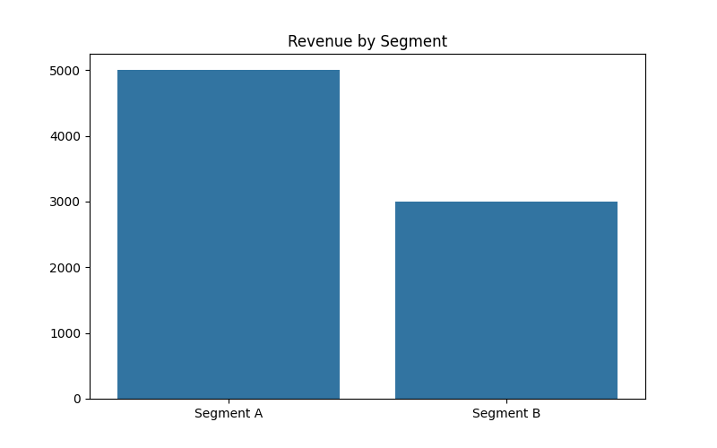
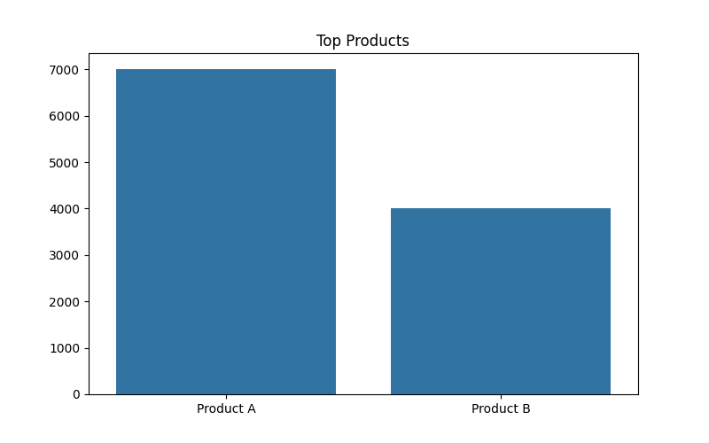
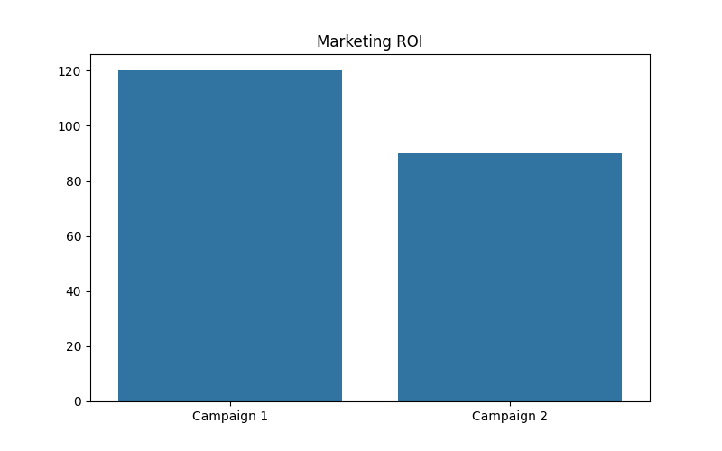
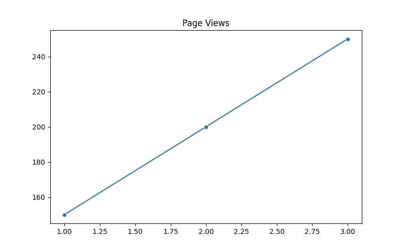
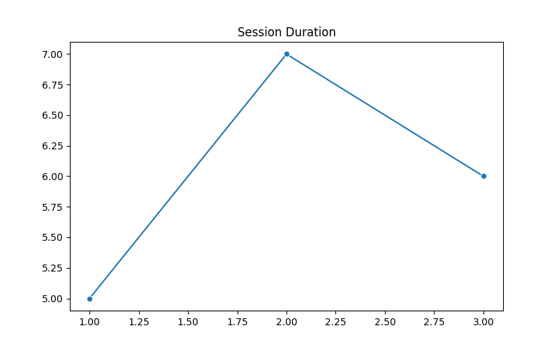

# 📊 Marketplace Analytics & Revenue Insights

A data-driven analysis of an online marketplace to understand revenue trends, user behavior, and marketing performance, with actionable recommendations to improve business outcomes.

---

## 📌 Business Problem
An online marketplace wants to better understand its performance across users, products, and marketing campaigns.

Key questions:
- Which products and categories drive the most revenue?
- Which user segments are most valuable?
- Are marketing campaigns delivering positive ROI?
- Where can the business improve performance?

---

## 🎯 Objective
Analyze marketplace data to uncover trends, evaluate key performance metrics, and provide actionable insights to improve revenue and user engagement.

---

## 📊 Dataset
Synthetic dataset simulating real-world marketplace operations:

- **Users:** 200+ users (age, gender, location, segments)  
- **Products:** 100+ products across categories (Electronics, Fashion, Home, Sports)  
- **Orders:** 300+ transactions (revenue, quantity, payment methods)  
- **Sessions:** Page views and session durations  
- **Campaigns:** Marketing channels, cost, leads, ROI  

---

## ⚙️ Approach

### 1. Data Preparation
- Cleaned and validated datasets  
- Structured data for analysis  

### 2. Exploratory Analysis
- Revenue trends across categories and segments  
- Product-level performance analysis  
- User engagement patterns (page views, session duration)  
- Marketing campaign performance (ROI analysis)  

### 3. Key Metrics
- Total Revenue  
- Top Products by Sales  
- Revenue by Segment  
- Campaign ROI  
- User Engagement Metrics  

---

## 📈 Key Insights

- A small number of products contribute to a large share of total revenue  
- Certain user segments show higher engagement and spending behavior  
- Marketing ROI varies significantly across channels  
- Some campaigns generate low ROI despite high spend  
- Higher user engagement correlates with increased conversion potential  

---

## 🚀 Business Recommendations

- 📌 Focus marketing spend on high-ROI campaigns  
- 📈 Promote top-performing products to maximize revenue  
- 🎯 Target high-value user segments with personalized strategies  
- 📉 Optimize or discontinue underperforming campaigns  
- 📊 Improve engagement strategies to increase session duration and conversions  

---

## 📊 Visualizations

### Revenue by Segment

### Top Products

### Marketing ROI

### User Engagement - Page Views

### User Engagement - Session Duration

---

## 🛠️ Tech Stack
- Python  
- Pandas  
- NumPy  
- Matplotlib  
- Seaborn  
- Plotly  

---

## ▶️ How to Run
1. Open the notebook in Google Colab  
2. Run all cells from top to bottom  

---

## 📘 What I Learned
- Analyzing marketplace data to uncover revenue drivers  
- Evaluating marketing effectiveness using ROI metrics  
- Identifying user behavior patterns and engagement trends  
- Translating data insights into actionable business decisions  

---

## 🔥 Key Takeaway
This project demonstrates how data analysis can uncover business opportunities, optimize marketing strategies, and drive data-informed decisions in a marketplace environment.

---

## 👤 Author
**Harika Komatireddy**  
[LinkedIn](https://www.linkedin.com/in/harika-komatyreddy) | [GitHub](https://github.com/Harshu2326)

